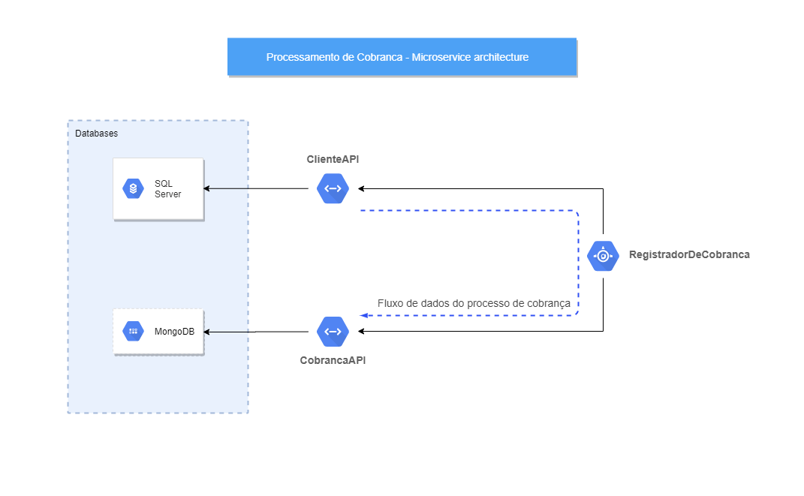

### Desafio Stone - Processamento de Cobrança

O objetivo do desafio é propor uma solução baseada em microserviços para efetuar a cobrança de clientes
de uma base de dados.

# Solução
A solução é composta de três projetos, sendo eles: ClienteAPI, CobrancaAPI e RegistradorDeCobranca.
O processo de cobrança acontece da seguinte forma:

1 - O RegistradorDeCobranca obtém todos os clientes através da `ClienteAPI`

2 - Para cada cliente, calcula o valor devido e instancia as `Cobrancas`.

3 - Envia o batch de `Cobrancas` para a `CobrancaAPI`.

## Diagrama da arquitetura

## Endpoints
As documentações das APIs foram geradas utilizando o Swashbuckle e estão disponíveis no endereço raiz das APIs.

## Execução

Configurar os endereços da `ClienteAPI` e da `CobrancaAPI` no arquivo `appsettings.json` no projeto `RegistradorDeCobranca`.   

- ClienteAPI:  
`dotnet run -p ClienteAPI`  
Ficará disponível em `localhost:5001`

- CobrancaAPI:  
`dotnet run -p CobrancaAPI`  
Ficará disponível em `localhost:5002`

- RegistradorDeCobranca:  
`dotnet run -p RegistradorDeCobranca`  
Ficará disponível em `localhost:5003`

## Implantação
As APIs `ClienteAPI`, `CobrancaAPI` e `RegistradorDeCobranca` e o banco de dados SQL da `ClienteAPI`
estão implantados na Azure. O MongoDB, banco da `CobrancaAPI`, está implantado no MongoDB Cloud.

- `ClienteAPI`: https://clienteapi.azurewebsites.net
- `CobrancaAPI`: https://cobrancaapi.azurewebsites.net
- `RegistradorDeCobranca`: https://registradordecobranca.azurewebsites.net